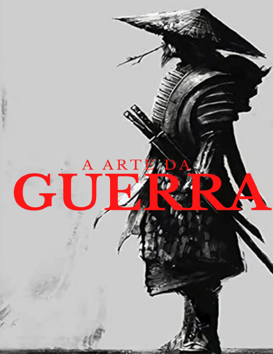

  

  <b>An Intelligent RAG-based Assistant trained on “The Art of War” by Sun Tzu</b>
   
  <a href="#-features">Features</a> •
  <a href="#-requirements">Requirements</a> •
  <a href="#-author">Author</a>
    
  
  
  
  
  

---

# 🧠 Sun Tzu AI Agent — *The Art of War* Chat

This project is a simple **Retrieval-Augmented Generation (RAG)** chatbot that answers questions **using the book “The Art of War” by Sun Tzu** as its only knowledge source.

It combines **LangChain**, **Chroma**, and **OpenAI models** to provide concise and context-based answers extracted from the book’s text.

---

## 🚀 Features

- 🗣️ **Interactive chat interface** built with **Streamlit**  
- 📚 **Retrieval-Augmented Generation** using **ChromaDB**  
- 🧩 Contextual responses based *only* on stored knowledge  
- 🧠 OpenAI-powered responses (model: `gpt-5-nano`)  
- ⚙️ Simple, lightweight, and easy to extend  

---

## 🧰 Requirements

- **Python 3.12+**
- OpenAI API key

---

## 🧑‍💻 Author

**Fábio Souza**  
Geographer & Data Scientist
🌎 Specialized in Geospatial Intelligence, AI, and Environmental Innovation  
📧 [LinkedIn](https://www.linkedin.com/in/fabio-ribeiro-de-souza-60007710)

---

## 📄 License

This project is intended for **educational and research purposes only**.  
All rights to the book *“Blue Carbon”* belong to **The Nature Conservancy** and the authors **Stefaine Simpson & Lindsey Smart**.

  <i>“Science, data, and AI — driving sustainability through knowledge.”</i>

